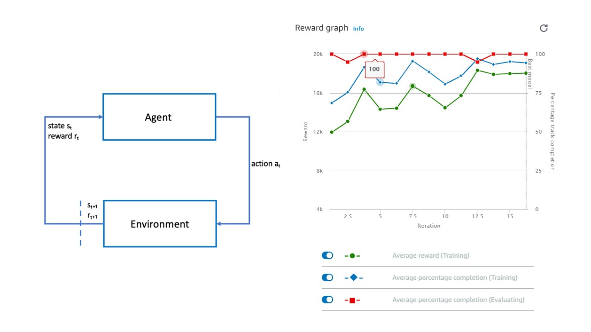
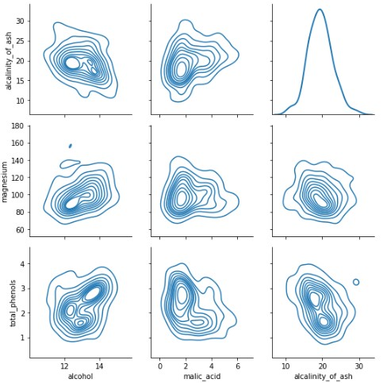

# Portfolio
---
## 1. Machine Learning: Retail Analytics
---

### Customer Churn Factors Analysis: XGBoost Model

**Customer Churn:** XGBoost model in Python

Using open-sourced data to illustrate a POC engagement with a customer, the goal of this analysis was not only to predict which customers are at risk of churning, but understanding the reasons/factors behind high churn probability. 

 

 
---

### Banking Fraud Detection: Anomaly Detection

**Anomaly Detection:** Multiple models in Python

Using anonamized retail banking data, the exercise is to compare multiple methods for supervised anomaly detection. This is still a work in progress but the models considered so far are XGBoost, Regular ANN, Random Forest classifier and a LSTM Auto-encoder. 
The dataset considers 30 anonamized vectors of data along with a time and amount variable. 

 

 
---

### Customer Cluster Analysis: PCA & KMeans

**Customer Clustering:** PCA & KMeans models in Python

Using open-sourced data to illustrate a POC engagement with a customer, the goal of this analysis was to segregate customers into an ideal number clusters, using PCA and Variance analysis to identify the ideal number. Once this is done, we use KMeans unsupervised learning to segregate customers into the required number of clusters. The final step is to create a summary profile of each cluster by predominant cluster features. 

 

 

---
## 2. Cloud Native
---

This section expands on some of the data science projects I have done while utilizing cloud platforms such as Azure, AWS or Google Cloud Platform. In the modern workplace, it is becoming increasingly important to understand and utilize tools and platforms for data science. The sheer compute power needed to train models alone can neccisitate the use of cloud platforms but in reality, there are many advantages for data in the cloud. The projects below illustrate some of the potential use cases 

### AWS Deep Racer: The funnest introduction to reinforcement learning

**Reinforcement Learning in Autonomous RC Cars**

 
AWS DeepRacer is an AWS Machine Learning service for exploring reinforcement learning that is focused on autonomous racing. The DeepRacer project remains at a relatively high level, with the use only needing to create the rewards function for the reinforcement algorithim (along with a couple hyper parameters). The rest is left up to a robust architecture comprised off a Convolutional Neural Network for feature extraction which inputs into a feed-forward neural network for decision making. 
 

 

 

The DeepRacer community is large, with many professional competitors. Many of the rewards functions are public and easily accessible even to absolute beginner users. That's what makes DeepRacer the perfect start for those curious about machine learning, presented in a practical and interactive way.
 
References:
- [Deep racer community](https://github.com/aws-deepracer-community)
- [AWS DeepRacer](https://www.kdd.org/kdd2016/papers/files/rfp0697-chenAemb.pdf](https://docs.aws.amazon.com/deepracer/latest/developerguide/deepracer-how-it-works-overview-reinforcement-learning.html))

 
---
## 3. Machine learning from scratch: Building models from the ground up
---

With modern python implementations, it is all too easy to build and implement a machine learning model with only a high level understanding of what goes on under the hood. In this series, it is my aim to build the most common machine learning algorithms from the ground up, utilizing the original documentation and no pre-built python libraries 

### XGBoost: The data scientist's _'Silver Bullet'_

**XGBoost from scratch**

 
The XGBoost model is a widely used adaptation of the popular gradient boosting model. In this exercise, I follow the implementation described below and step by step, build up the XGBoost model as it was designed in it's original paper. 
 

 

 

In this exercise, I use the pre-built XGBoost package and compare it against the from-scratch implementation while trying to predict the _alchol content_ in wine given certain features.

References:
- [xgboost-from-scratch](https://blog.mattbowers.dev/xgboost-from-scratch)
- [XGBoost: A Scalable Tree Boosting System](https://www.kdd.org/kdd2016/papers/files/rfp0697-chenAemb.pdf)

---
## 4. Machine Learning: Computer Vision
---

### Connected Conservation: Animal Detection Pipeline

**Animal Detection:** Computer vision detection pipeline in Python

Through a partnership with the Connected Conservation Foundation, Airbus and Microsoft our team conducted research into the feasibility of using high-resolution satellite imagery to perform object detection and classification of animals from space. 

**Copyright:** Connected Conservation Foundation, Airbus, Microsoft and Dimension Data. Any use of this work without prior permission from the relevant stakeholders named above is forbidden. 

 

---

### Computer vision methods: Saliency Detection

**Saliency Detection:** Computer vision object detection methodology using Open-CV built in saliency detector.

 Detecting boundaries in images is an important but difficult part of any computer vision process. A boundary is considered any piece-wise set of points seperating multiple distinct feature areas. The more complex or noisy the image, the more difficult it is to find this boundary. Open-CV has a built in operator for saliency detection. Saliency simply means seperation of object against its background. It does this by using an implementation (albeit much more complex) of the Hough transform, a mathematical approach to finding lines within an image.

 

As a fun twist to this project, I experimented with using Open-AI's DALL-E 2 model, a diffusitive (and generative) machine learning model that uses text to create images.

 

 

 

**Copyright:** OPEN-AI's DALL-E 2 model was used to auto-generate the images used in this project. 

 

---

## Useful Code Snippets

- [Project 1 Title](http://example.com/)
- [Project 2 Title](http://example.com/)
- [Project 3 Title](http://example.com/)
- [Project 4 Title](http://example.com/)
- [Project 5 Title](http://example.com/)

---

---

Page template forked from <a href="https://github.com/evanca/quick-portfolio">evanca</a>

<!-- Remove above link if you don't want to attibute -->
