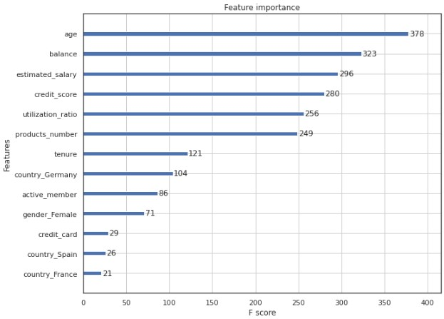
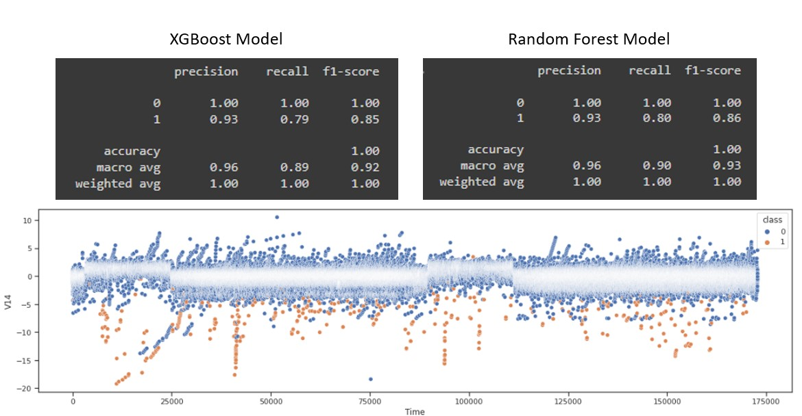
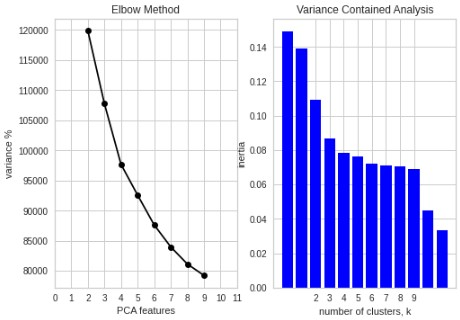
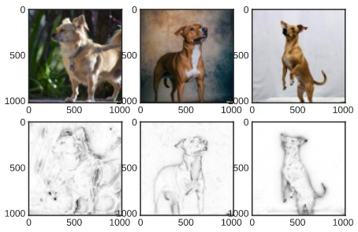

# Portfolio

## 1. Machine Learning: Retail Analytics
---

### Customer Churn Factors Analysis: XGBoost Model

**Customer Churn:** XGBoost model in Python

Using open-sourced data to illustrate a POC engagement with a customer, the goal of this analysis was not only to predict which customers are at risk of churning, but understanding the reasons/factors behind high churn probability. 

 

 
---

### Banking Fraud Detection: Anomaly Detection

**Anomaly Detection:** Multiple models in Python

Using anonamized retail banking data, the exercise is to compare multiple methods for supervised anomaly detection. This is still a work in progress but the models considered so far are XGBoost, Regular ANN, Random Forest classifier and a LSTM Auto-encoder. 
The dataset considers 30 anonamized vectors of data along with a time and amount variable. 

 

 
---

### Customer Cluster Analysis: PCA & KMeans

**Customer Clustering:** PCA & KMeans models in Python

Using open-sourced data to illustrate a POC engagement with a customer, the goal of this analysis was to segregate customers into an ideal number clusters, using PCA and Variance analysis to identify the ideal number. Once this is done, we use KMeans unsupervised learning to segregate customers into the required number of clusters. The final step is to create a summary profile of each cluster by predominant cluster features. 

 

 

---
## 2. Machine Learning: Computer Vision
---

### Connected Conservation: Animal Detection Pipeline

**Animal Detection:** Computer vision detection pipeline in Python

Through a partnership with the Connected Conservation Foundation, Airbus and Microsoft our team conducted research into the feasibility of using high-resolution satellite imagery to perform object detection and classification of animals from space. 

**Copyright:** Connected Conservation Foundation, Airbus, Microsoft and Dimension Data. Any use of this work without prior permission from the relevant stakeholders named above is forbidden. 

 

---

### Computer vision methods: Saliency Detection

**Saliency Detection:** Computer vision object detection methodology using Open-CV built in saliency detector.

 Detecting boundaries in images is an important but difficult part of any computer vision process. A boundary is considered any piece-wise set of points seperating multiple distinct feature areas. The more complex or noisy the image, the more difficult it is to find this boundary. Open-CV has a built in operator for saliency detection. Saliency simply means seperation of object against its background. It does this by using an implementation (albeit much more complex) of the Hough transform, a mathematical approach to finding lines within an image.

 

 

**Copyright:** OPEN-AI's DALL-E 2 model was used to auto-generate the images used in this project. 

 

---

## Useful Code Snippets

- [Project 1 Title](http://example.com/)
- [Project 2 Title](http://example.com/)
- [Project 3 Title](http://example.com/)
- [Project 4 Title](http://example.com/)
- [Project 5 Title](http://example.com/)

---

---

Page template forked from <a href="https://github.com/evanca/quick-portfolio">evanca</a>

<!-- Remove above link if you don't want to attibute -->
